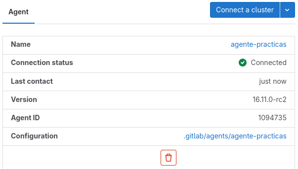

# Continuous Integration and Continuous Deployment

## TABLA DE CONTENIDO

- [Docker Compose](#docker-compose)
- [Pipelines](#pipelines)
- [GitLab Runner](#gitlab-runner)
  - [Crear un nuevo `Runner`](#crear-un-nuevo-runner)
  - [Crear un contenedor con GitLab Runner](#crear-un-contenedor-con-gitlab-runner)
  - [Registrar el Runner](#registrar-el-runner)
  - [Eliminar registro del Runner](#eliminar-registro-del-runner)
- [GitLab con Kubernetes](#gitlab-con-kubernetes)
  - [Requisitos](#requisitos)
  - [Instalación de GitLab Runner en Kubernetes](#instalación-de-gitlab-runner-en-kubernetes)
    - [Versión de `kubectl`](#versión-de-kubectl)
    - [Instalar Agente](#instalar-agente)
      - [Crear un archivo de configuración para un agente](#crear-un-archivo-de-configuración-para-un-agente)
      - [Registrar el agente con GitLab](#registrar-el-agente-con-gitlab)
      - [Instalar el agente en el clúster](#instalar-el-agente-en-el-clúster)
    - [Instalar Gitlab Runner en el clúster](#instalar-gitlab-runner-en-el-clúster)
      - [Crear archivo de configuración para el GitLab Runner](#crear-archivo-de-configuración-para-el-gitlab-runner)
      - [Instalación utilizando Helm](#instalación-utilizando-helm)
      - [Revisión](#revisión)
        - [En GitLab](#en-gitlab)
        - [En el clúster](#en-el-clúster)
- [Notas](#notas)
- [Referencias](#referencias)

## Docker Compose

```shell
sudo dnf install docker-compose
```

```shell
docker build --tag micro_agify -f server.Dockerfile .

docker run -d --name m_agify -p 3000:3000 --env HOST=0.0.0.0 --env PORT=3000 micro_agify:latest
```

```shell
docker build --tag testing_agify -f testing.Dockerfile .

docker run --name t_agify testing_agify

docker run --name t_agify --env SERVER="http://172.17.0.1:3011" testing_agify
```

## Pipelines

Repo > Build > Pipelines > Use Docker template

Crear el archivo `.gitlab-ci.yml`

```yml
# This file is a template, and might need editing before it works on your project.
# To contribute improvements to CI/CD templates, please follow the Development guide at:
# https://docs.gitlab.com/ee/development/cicd/templates.html
# This specific template is located at:
# https://gitlab.com/gitlab-org/gitlab/-/blob/master/lib/gitlab/ci/templates/Docker.gitlab-ci.yml

# Build a Docker image with CI/CD and push to the GitLab registry.
# Docker-in-Docker documentation: https://docs.gitlab.com/ee/ci/docker/using_docker_build.html
#
# This template uses one generic job with conditional builds
# for the default branch and all other (MR) branches.

docker-build:
  # Use the official docker image.
  image: docker:cli
  stage: build
  services:
    - docker:dind
  variables:
    DOCKER_IMAGE_NAME: $CI_REGISTRY_IMAGE:$CI_COMMIT_REF_SLUG
  before_script:
    - docker login -u "$CI_REGISTRY_USER" -p "$CI_REGISTRY_PASSWORD" $CI_REGISTRY
  # All branches are tagged with $DOCKER_IMAGE_NAME (defaults to commit ref slug)
  # Default branch is also tagged with `latest`
  script:
    - docker build --pull -t "$DOCKER_IMAGE_NAME" .
    - docker push "$DOCKER_IMAGE_NAME"
    - |
      if [[ "$CI_COMMIT_BRANCH" == "$CI_DEFAULT_BRANCH" ]]; then
        docker tag "$DOCKER_IMAGE_NAME" "$CI_REGISTRY_IMAGE:latest"
        docker push "$CI_REGISTRY_IMAGE:latest"
      fi
  # Run this job in a branch where a Dockerfile exists
  rules:
    - if: $CI_COMMIT_BRANCH
      exists:
        - Dockerfile
```

## GitLab Runner

Se utilizará un contenedor de GitLab Runner para ejecutar los pipelines. Se utilizará la documentación de oficial para [Instalar GitLab Runner](https://docs.gitlab.com/runner/install/) pero particularmente [Correr GitLab Runner en un contenedor](https://docs.gitlab.com/runner/install/docker.html).

Primero se debe descargar la imagen desde [Docker Hub](https://hub.docker.com/r/gitlab/gitlab-runner/tags) con el siguiente comando:

```shell
docker pull gitlab/gitlab-runner:latest
```

Se puede probar GitLab Runner en un contenedor desechable ejecutando el `runner commnad and options`, la estructura para ejecutar es `docker run <chosen docker options...> gitlab/gitlab-runner <runner command and options...>`. Por ejemplo:

```shell
docker run --rm -t -i gitlab/gitlab-runner --help
```

La documentación oficial indica:

```
In short, the gitlab-runner part of the command is replaced with docker run [docker options] gitlab/gitlab-runner, while the rest of the command stays as it is described in the register documentation. The only difference is that the gitlab-runner command is executed inside of a Docker container.
```

Eso quiere decir que podemos utilizar gitlab-runner como si estuviera instalada en el equipo local, puede ejecutar todos los comandos descritos en la documentación oficial

### Crear un nuevo `Runner`

De acuerdo a la documentación oficial se debe [crear un nuevo `Project Runner`](https://docs.gitlab.com/ee/ci/runners/runners_scope.html#create-a-project-runner-with-a-runner-authentication-token). Para hacerlo se deben seguir los siguientes pasos:

1. Ingresar al proyecto de GitLab, ubicar la barra lateral izquierda.
2. Seleccionar **Settings > CI/CD.**
3. Expandir la sección **Runners**.
4. Seleccionar **New project runner**.
5. Seleccionar el **Sistema Operativo** donde GitLab Runner está instalado. En nuestro caso será **Linux** puesto que utilizamos una imagen de Docker con ese OS.
6. En la sección de Tags, en el campo de Tags, ingresar las etiquetas de trabajo para especificarle al runner cuáles puede ejecutar. Si no hay etiquetas de trabajo para el runner entonces seleccionar **Run untagged jobs**.
7. Opcional. En el campo de **descripción** del Runner, agregar una descripción para el Runner que se mostrará en GitLab.
8. Opcional. En la sección de **Configuration**, agregarconfiguraciones adicionales.
9. Seleccionar **Create runner**.

**IMPORTANTE**: Anotar el token generado con formato `glrt-xxxxx`, éste se utilizará para el registro del Runner.

### Crear un contenedor con GitLab Runner

De acuerdo a la [documentación](https://docs.gitlab.com/runner/install/docker.html#option-2-use-docker-volumes-to-start-the-runner-container) primero crearémos un volúmen:

```shell
docker volume create gitlab-runner-config
```

Luego creamos un contenedor y le asociamos el volúmen recién creado:

```shell
docker run -d --name gitlab-runner --restart always \
    -v /var/run/docker.sock:/var/run/docker.sock \
    -v gitlab-runner-config:/etc/gitlab-runner \
    gitlab/gitlab-runner:latest
```

### Registrar el Runner

Para [registrar el Runner con autenticación por Token](https://docs.gitlab.com/runner/register/index.html?tab=Docker#register-with-a-runner-authentication-token) crearémos un contenedor desechable con los valores del nuevo Runner. Ingresar el valor del token generado anteriormente en la [creación del nuevo runner](#crear-un-nuevo-runner) a la variable `$RUNNER_TOKEN`, definir la imagen Docker que se utilizará para los pipelines con el argumento `--docker-image docker:25.0.5`: El comando quedaría así:

```shell
docker run --rm -v create gitlab-runner-config:/etc/gitlab-runner gitlab/gitlab-runner register \
  --non-interactive \
  --url "https://gitlab.com/" \
  --token "$RUNNER_TOKEN" \
  --executor "docker" \
  --docker-image docker:25.0.5 \
  --description "docker-runner"
```

Si correr el comando anterior no funciona para registrar el Runner también se puede probar ingresar al [contenedor creado](#crear-un-contenedor-con-gitlab-runner) con el comando:

```shell
docker exec -it gitlab-runner bash
```

dentro del contenedor `gitlab-runner` ejecutar:

```shell
gitlab-runner register
```

y completar los datos solicitados. Además del ingreso de los datos tuve que hacer una modificación al archivo de configuración `config.toml` porque _GitLab Runner_ no tenía vinculado el volúmen de mi docker local y no tenía permisos de crear contenedores así que primero instalé un editor de texto con los siguientes comandos:

```shell
apt update && apt install nano
```

Antes de la modificación el archivo se encuentra así:

```toml
$ cat /etc/gitlab-runner/config.toml
concurrent = 1
check_interval = 0
connection_max_age = "15m0s"
shutdown_timeout = 0

[session_server]
  session_timeout = 1800

[[runners]]
  name = "runner-docker-25-0-5"
  url = "https://gitlab.com/"
  id = 34232754
  token = "glrt-9Ar..."
  token_obtained_at = 2024-03-29T18:22:03Z
  token_expires_at = 0001-01-01T00:00:00Z
  executor = "docker"
  [runners.cache]
    MaxUploadedArchiveSize = 0
  [runners.docker]
    tls_verify = false
    image = "docker:25.0.5"
    privileged = false
    disable_entrypoint_overwrite = false
    oom_kill_disable = false
    disable_cache = false
    volumes = ["/cache"]
    shm_size = 0
    network_mtu = 0
```

Abrir el archivo para modificarlo

```shell
nano /etc/gitlab-runner/config.toml
```

Edité los valores de `privileged = true` y `volumes = ["/cache", "/var/run/docker.sock:/var/run/docker.sock"]`. Notar que en el valor `image = "docker:25.0.5"` tiene la versión de docker de mi equipo local, se puede probar utilizar el tag `docker:latest` pero en esta ocación no se hizo. El archivo final de la siguiente forma:

```toml
$ cat /etc/gitlab-runner/config.toml
concurrent = 1
check_interval = 0
connection_max_age = "15m0s"
shutdown_timeout = 0

[session_server]
  session_timeout = 1800

[[runners]]
  name = "runner-docker-25-0-5"
  url = "https://gitlab.com/"
  id = 34232754
  token = "glrt-9Ar..."
  token_obtained_at = 2024-03-29T18:22:03Z
  token_expires_at = 0001-01-01T00:00:00Z
  executor = "docker"
  [runners.cache]
    MaxUploadedArchiveSize = 0
  [runners.docker]
    tls_verify = false
    image = "docker:25.0.5"
    privileged = true
    disable_entrypoint_overwrite = false
    oom_kill_disable = false
    disable_cache = false
    volumes = ["/cache", "/var/run/docker.sock:/var/run/docker.sock"]
    shm_size = 0
    network_mtu = 0
```

Reiniciar el contenedor:

```shell
docker restart gitlab-runner
```

Con esto se finaliza la configuración del `Runner local`, ahora solo queda visualizar los _logs_ de las tareas que se ejecutan en él:

```shell
docker logs gitlab-runner --follow
```

**IMPORTANTE**: Para canalizar el trabajo de los pipelines a éste Runner es importante desabilitar los Runners compartidos.

### [Eliminar registro del Runner](https://docs.gitlab.com/runner/commands/#gitlab-runner-unregister)

```shell
gitlab-runner unregister --url "https://gitlab.com/" --token t0k3n
gitlab-runner unregister --name test-runner
```

## GitLab con Kubernetes

Para ejecutar los pipelines de GitLab se pueden utilizar los [Kubernetes executor](https://docs.gitlab.com/runner/executors/kubernetes/). Para esta tarea utilizaremos una Instancia de GitLab Runner oficial para ejecutar en Kubernetes, se utilizará [Helm](https://helm.sh/) para hacer la instalación del recurso según la documentación [GitLab Runner Helm Chart](https://docs.gitlab.com/runner/install/kubernetes.html)

### Requisitos

- [Crear un nuevo clúster de Kubernetes](./README.md#crear-un-nuevo-clúster-de-kubernetes) como se detalla en el archivo [README.md](./README.md#crear-un-nuevo-clúster-de-kubernetes).

### Instalación de GitLab Runner en Kubernetes

#### Versión de `kubectl`

```shell
$ kubectl version
WARNING: This version information is deprecated and will be replaced with the output from kubectl version --short.  Use --output=yaml|json to get the full version.
Client Version: version.Info{Major:"1", Minor:"27", GitVersion:"v1.27.11", GitCommit:"b9e2ad67ad146db566be5a6db140d47e52c8adb2", GitTreeState:"clean", BuildDate:"2024-02-14T10:40:40Z", GoVersion:"go1.21.7", Compiler:"gc", Platform:"linux/amd64"}
Kustomize Version: v5.0.1
Server Version: version.Info{Major:"1", Minor:"27", GitVersion:"v1.27.8-gke.1067004", GitCommit:"6f460c12ad45abb234c18ec4f0ea335a1203c415", GitTreeState:"clean", BuildDate:"2024-01-04T22:48:32Z", GoVersion:"go1.20.11 X:boringcrypto", Compiler:"gc", Platform:"linux/amd64"}
```

#### Instalar Agente

Se utilizará la documentación de GitLab, [Installing the agent for Kubernetes](https://docs.gitlab.com/ee/user/clusters/agent/install/index.html), para la instalación del agente de este proyecto.

##### [Crear un archivo de configuración para un agente](https://docs.gitlab.com/ee/user/clusters/agent/install/index.html#create-an-agent-configuration-file)

Crear el archivo `config.yaml` en la siguiente ubicación:

```
.gitlab/agents/<agent-name>/config.yaml
```

El contenido del archivo para que se [autorice al agente el acceso al proyecto](https://docs.gitlab.com/ee/user/clusters/agent/ci_cd_workflow.html#authorize-the-agent-to-access-your-projects) será:

```yaml
ci_access:
  projects:
    - id: cursos_usac/practicassa
```

A este proyecto se le creó el agente `agente-practicas`.

##### [Registrar el agente con GitLab](https://docs.gitlab.com/ee/user/clusters/agent/install/index.html#create-an-agent-configuration-file)

En esta ocasión se agregará el Clúster de Kubernetes únicamente a éste proyecto, GitLab permite asociarlo también a grupos o a la cuenta. Para agregarlo se siguen los siguientes pasos:

1. Ingresar al proyecto de GitLab, ubicar la barra lateral izquierda.
2. Seleccionar **Operate > Kubernetes clusters**
3. Persionar sobre **Connect a cluster**.
4. Expandir el listado **Select an agent or enter a name to create new**, ahí debería de aparecer el agente creado en la sección [Crear un archivo de configuración para un agente](#crear-un-archivo-de-configuración-para-un-agente)
5. Presionar en **Register**.
6. Guardar el Script que se genera al Registrar el agente.

##### [Instalar el agente en el clúster](https://docs.gitlab.com/ee/user/clusters/agent/install/index.html#install-the-agent-in-the-cluster)

Se utilizará **Helm** para hacer la [instalación del agente](https://docs.gitlab.com/ee/user/clusters/agent/install/index.html#install-the-agent-with-helm) en el cluster. El clúster provisto por Google Cloud ya tiene una versión instalada por lo que se utilizará esa para continuar:

```shell
$ helm version
version.BuildInfo{Version:"v3.9.3", GitCommit:"414ff28d4029ae8c8b05d62aa06c7fe3dee2bc58", GitTreeState:"clean", GoVersion:"go1.17.13"}
```

Utilizar el script que se generó en el `paso 6` de [Registrar el agente con GitLab](#registrar-el-agente-con-gitlab). El script tiene un formato como el siguiente:

```shell
helm repo add gitlab https://charts.gitlab.io
helm repo update
helm upgrade --install test gitlab/gitlab-agent \
    --namespace gitlab-agent-test \
    --create-namespace \
    --set image.tag=<current agentk version> \
    --set config.token=<your_token> \
    --set config.kasAddress=<address_to_GitLab_KAS_instance>
```

Script generado para este proyecto:

```shell
helm repo add gitlab https://charts.gitlab.io
helm repo update
helm upgrade --install agente-practicas gitlab/gitlab-agent \
    --namespace gitlab-agent-agente-practicas \
    --create-namespace \
    --set image.tag=v16.11.0-rc2 \
    --set config.token=<TOKEN> \
    --set config.kasAddress=wss://kas.gitlab.com
```

#### Instalar Gitlab Runner en el clúster

Para instalar GitLab Runner en el clúster utilizando Helm Chart se necesitan cumplir los siguientes prerrequisitos. Estos aplican para la instalación que estamos llevando a cabo, otras instalaciones podrían necesitar más o menos cosas:

- Your GitLab server’s API is reachable from the cluster.
- Kubernetes 1.4+ with Beta APIs enabled.
- [`kubectl CLI` instalado localmente y autenticado al clúster](README.md#instalar-componente-kubectl)
- [Instalación del Cliente Helm](https://helm.sh/docs/intro/install/) localmente.

##### [Crear archivo de configuración para el GitLab Runner](https://docs.gitlab.com/runner/install/kubernetes.html#configuring-gitlab-runner-using-the-helm-chart)

Crear el archivo [`values.yaml`](./GitLabRunner/values.yaml). La configuración predeterminada para el archivo se encuentra en el [respositorio](https://gitlab.com/gitlab-org/charts/gitlab-runner/blob/main/values.yaml). De la configuración predeterminada del archivo anterior Y la configuración requerida, la versión final del archivo queda algo similar a:

```shell
gitlabUrl: https://gitlab.com/

runnerToken: "<TOKEN>"

concurrent: 10

checkInterval: 30

rbac:
  create: true
  rules:
    - apiGroups: [""]
      resources: ["pods"]
      verbs: ["list", "get", "watch", "create", "delete"]
    - apiGroups: [""]
      resources: ["pods/exec"]
      verbs: ["create"]
    - apiGroups: [""]
      resources: ["pods/log"]
      verbs: ["get"]
    - apiGroups: [""]
      resources: ["pods/attach"]
      verbs: ["list", "get", "create", "delete", "update"]
    - apiGroups: [""]
      resources: ["secrets"]
      verbs: ["list", "get", "create", "delete", "update"]
    - apiGroups: [""]
      resources: ["configmaps"]
      verbs: ["list", "get", "create", "delete", "update"]

runners:
  privileged: true

  config: |
    [[runners]]
      [runners.kubernetes]
        namespace = "gitlab-runners-namespace"
        tls_verify = false
        image = "docker"
        privileged = true
        [[runners.kubernetes.volumes.host_path]]
          name = "docker"
          mount_path = "/var/run/docker.sock"

```

**Consideraciones**: [Prevent host kernel exposure](https://docs.gitlab.com/runner/executors/kubernetes/#prevent-host-kernel-exposure) menciona la exposición que se tiene por utilizar `mount_path = "/var/run/docker.sock"`

los demás valores ya vienen definidos en la configuración predeterminada del respotorio anterior.

##### [Instalación utilizando Helm](https://docs.gitlab.com/runner/install/kubernetes.html#installing-gitlab-runner-using-the-helm-chart)

Agregar el repositorio GitLab de Helm:

```shell
helm repo add gitlab https://charts.gitlab.io
```

Si se desea tener la última versión del GitLab Runner entonces se debe de actualizar el paquete de Helm.

```shell
helm repo update gitlab
```

Para ver el listado de versiones de GitLab Runner disponibles, correr:

```shell
helm search repo -l gitlab/gitlab-runner
```

Ver la versión de Helm instalada

```shell
$ helm version
version.BuildInfo{Version:"v3.11", GitCommit:"", GitTreeState:"", GoVersion:"go1.21rc3"}
```

Como es la versión 3 entonces se creará un GitLab Runner de la siguiente manera

```shell
helm install --namespace <NAMESPACE> gitlab-runner -f <CONFIG_VALUES_FILE> gitlab/gitlab-runner
```

Creamos un nuevo namespace en el clúster para albergar los Runners

```shell
kubectl create namespace gitlab-runners-namespace
```

En la terminal nos posicionamos en la carpeta donde se encuentra el archivo de configuración elaborado en [Crear archivo de configuración para el GitLab Runner](#crear-archivo-de-configuración-para-el-gitlab-runner). Para este proyecto es en `./GitLabRunner`

Ya dentro de la carpeta, creado el archivo y el namespace dentro del clúster entonces ejecutamos:

```shell
helm install --namespace gitlab-runners-namespace gitlab-runner -f values.yaml gitlab/gitlab-runner
```

Se se desea hacer una [actualización a las configuraciones del Runner](https://docs.gitlab.com/runner/install/kubernetes.html#upgrading-gitlab-runner-using-the-helm-chart) se puede cambiar el archivo `values.yaml` y cargarlo nuevamento con el siguiente comando:

```shell
helm upgrade --namespace gitlab-runners-namespace -f values.yaml gitlab-runner gitlab/gitlab-runner
```

Desinstalar Runner

```shell
helm uninstall --namespace gitlab-runners-namespace gitlab-runner
```

**NOTA**: Cuando había un cambio de configuración en el `values.yaml`, salía más facil eliminar e instalar el Runner, `upgrade` también funcionaba pero yo prefería hacerlo eliminando/instalando.

##### Revisión

Si todo ha transcurrido con normalidad entonces se podría ver el siguiente estado del agente:

###### En GitLab



###### En el clúster

```shell
$ kubectl get namespaces
NAME                            STATUS   AGE
default                         Active   96m
gitlab-agent-agente-practicas   Active   12m
...
```

```shell
$ kubectl get all -n gitlab-agent-agente-practicas
NAME                                                    READY   STATUS    RESTARTS   AGE
pod/agente-practicas-gitlab-agent-v2-56f7467558-qsnv5   1/1     Running   0          172m
pod/agente-practicas-gitlab-agent-v2-56f7467558-rf8px   1/1     Running   0          172m

NAME                                               READY   UP-TO-DATE   AVAILABLE   AGE
deployment.apps/agente-practicas-gitlab-agent-v2   2/2     2            2           172m

NAME                                                          DESIRED   CURRENT   READY   AGE
replicaset.apps/agente-practicas-gitlab-agent-v2-56f7467558   2         2         2       172m       144m
```

# Notas

```shell
git checkout -b feature/fun_14 && git push -u origin feature/fun_14
```

```shell
kubectl get pods --namespace gitlab-runners-namespace
```

```shell

```

```shell

```

# Referencias

- [GitLab CI/CD - Providing your own docker runners](https://www.youtube.com/watch?v=Y0qT6MCnRG0)
- [GitLab CI CD | Install and Configure GitLab Runner on Kubernetes with Helm](https://www.youtube.com/watch?v=0Fes86qtBSc)
- [Gitlab CI / CD con Google Kubernetes Engine: cómo crear un clúster de GKE y agregarlo a Gitlab](https://www.youtube.com/watch?v=9TaZtZhrykU)
- [CI/CD YAML syntax reference](https://docs.gitlab.com/ee/ci/yaml/index.html)
- [Pipeline architecture](https://docs.gitlab.com/ee/ci/pipelines/pipeline_architectures.html#basic-pipelines)
- [CI/CD YAML syntax reference - stages](https://docs.gitlab.com/ee/ci/yaml/index.html#stages)
- [GitLab CI/CD variables](https://docs.gitlab.com/ee/ci/variables/)
- [Predefined CI/CD variables reference](https://docs.gitlab.com/ee/ci/variables/predefined_variables.html)
- [Continuous Deployment with GitLab and Kubernetes](https://cylab.be/blog/112/continuous-deployment-with-gitlab-and-kubernetes)
- [Gitlab CI runner on Kubernetes cluster](https://www.linkedin.com/pulse/gitlab-ci-runner-kubernetes-cluster-zeyneb-sdiri/)
- [How to setup GitLab Runner on Kubernetes Cluster](https://8grams.medium.com/how-to-setup-gitlab-runner-on-kubernetes-cluster-e4caf688ca89)
