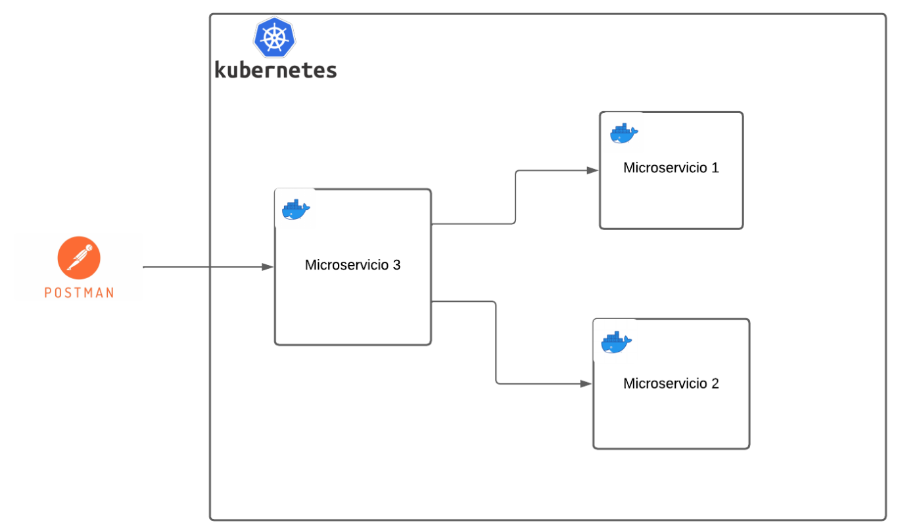
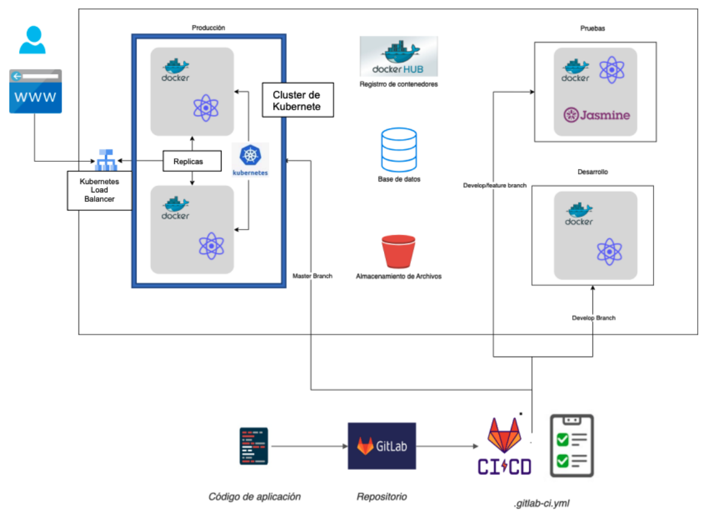
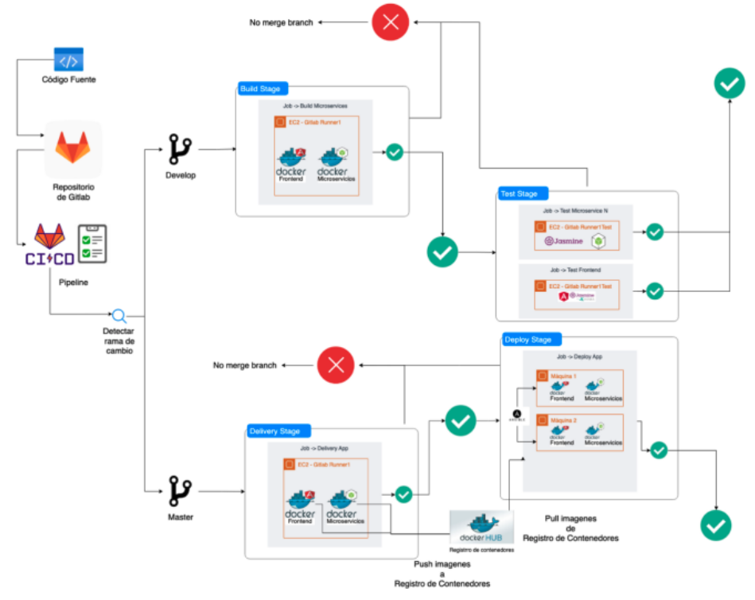

# Prácticas - Laboratorio Software avanzado

## TABLA DE CONTENIDO

- [Acerca del proyecto](#acerca-del-proyecto)
  - [Práctica 2](#práctica-2)
    - [Diagrama de arquitectura a implementar](#diagrama-de-arquitectura-a-implementar-en-la-práctica-2)
  - [Práctica 3](#práctica-3)
    - [Diagrama de arquitectura a implementar](#diagrama-de-arquitectura-a-implementar-en-la-práctica-3)
    - [Descripción del flujo](#descripción-del-flujo)
- [Arquitectura](#arquitectura)
  - [Diagrama](#diagrama)
  - [Tecnología utilizada](#tectología-utilizada)
- [Microservicios](#microservicios)
  - [Estructura de los proyectos](#estructura-de-los-proyectos)
    - [Tests](#tests)
  - [Contrato de microservicios](#contrato-de-microservicios)
- [Dockerfile](#dockerfile)
  - [Crear la imagen](#crear-la-imagen)
- [Minikube](#minikube)
  - [Instalación de Minikube](#instalación-de-minikube)
  - [Iniciar Minikube](#iniciar-minikube)
  - [Desplegar servicios](#desplegar-servicios)
    - [Microservicio Agify]()
    - [Microservicio Genderize]()
    - [Middleware]()
- [GCP](#gcp)
  - [Lanzar proyecto en Kubernetes](#lanzar-proyecto-en-kubernetes)
  - [Conectar a GCP a través de la terminal](#conectar-a-gcp-a-través-de-la-terminal)
    - [Contenido del paquete](#contenido-del-paquete)
    - [Instalación](#instalación)
    - [Kubernetes desde GCP](#kubernetes-desde-gcp)
- [CI/CD](#cicd)

## Acerca del proyecto

### Práctica 2

#### Diagrama de arquitectura a implementar en la práctica 2



### Práctica 3

#### Diagrama de arquitectura a implementar en la práctica 3



#### Descripción del flujo



Enunciados:

- [Práctica 2](./assets/enunciados/[SA]%20Practica%202%20-%201s2024.pdf)
- [Práctica 3](./assets/enunciados/[SA]%20Practica%203%20-%201s2024.pdf)

## Arquitectura

### Diagrama


### Tectología utilizada

TODO:Generar el contenido

## Microservicios

### Estructura de los proyectos

A cada microservicio ejecutarle:

```shell
npm install swagger-ui-express
npm install swagger-autogen


npm install --save-dev swagger-autogen
npm install swagger-ui-express --save
```

Agregar el código del servidor en `server.js`. Ejemplo del microservicio 1:

```js
const express = require("express");
require("dotenv").config();
const app = express();
const swaggerUi = require("swagger-ui-express");
const swaggerDocument = require("./swagger.json");

const host = process.env.HOST;
const port = process.env.PORT;

const docs = "/api";
app.use(docs, swaggerUi.serve, swaggerUi.setup(swaggerDocument));

// Endpoint para obtener datos
app.get("/", (req, res) => {
  if (!req.query.name) {
    return res
      .status(400)
      .send(
        `Le hace falta un parámetro, revise la documentación en http://${host}:${port}${docs}/`
      );
  }

  fetch("https://api.agify.io/?name=" + req.query.name)
    .then((response) => response.json())
    .then((data) => {
      res.send(data);
    });
});

app.listen(port, host, () => {
  console.log(
    `\nServer running at http://${host}:${port}/.\nSee the documentation at http://${host}:${port}${docs}`
  );
});
```

Crear el archivo `swagger.js` que contendrá los datos de la documentación de Swagger, a partir de este documento se crea automáticamente la documentación:

```js
const swaggerAutogen = require("swagger-autogen")();
require("dotenv").config();

const host = process.env.HOST;
const port = process.env.PORT;

const doc = {
  info: {
    title: "Microservicio 1",
    description:
      'Se consume el servicio https://api.agify.io/ reenviando el parámetro "name"',
  },
  host: `${host}:${port}`,
};

const outputFile = "./swagger.json";
// assuming your routes are located in app.js
const routes = ["./server.js"];
swaggerAutogen(outputFile, routes, doc);
```

Agregar al `package.json` los scripts para crear la documentación automática (npm run swagger) y el script completo que instalará, documentará y levantará el servidor (npm run start).

```json
{
  "scripts": {
    "swagger": "node ./swagger.js",
    "start": "npm install && node ./swagger.js && node server.js"
  }
}
```

Si se quiere probar en local agregar el archivo `.env` con las variables de entorno. Ejemplo del microservicio 1:

```
HOST=localhost
PORT=3011
```

#### Tests

TODO: Generar el contenido

```shell
npm install -D jest supertest
```

### Contrato de microservicios

TODO: Generar el contenido

## Dockerfile

Una vez completado los microservicios procedemos a crear la imágen de docker. El siguiente es un ejemplo del Dockerfile para el microservicio 1:

```yaml
FROM node:hydrogen-alpine3.19
LABEL maintainer="Feliciano Franco"
LABEL email="f64franco@gmail.com"
LABEL description = "Microservicio 1."
EXPOSE 3000
WORKDIR /app
COPY ./package.json ./
COPY ./swagger.js ./
COPY ./server.js ./
CMD ["npm", "run", "start"]
```

### Crear la imagen

Ubicarse dentro de la carpeta del microservicio

```shell
cd microservicio_1
```

Crear la imágen

```shell
docker build --tag f64franco/micro1:practica2 ./
```

Para probar se puede crear contenedor a partir de la imagen nueva.

```shell
docker run -d --name micro1 -p 3000:3000 --env HOST=0.0.0.0 --env PORT=3000 f64franco/micro1:practica2
```

## Minikube

### Instalación de Minikube

Se instalará _Minikube_ a partir de la [documentación oficial](https://minikube.sigs.k8s.io/docs/start/) para simular un ambiente con Kubernetes.

Para una instalación en:

- Operating system: Linux
- Architecture: x86-64
- Release type: Stable
- Installer type: RPM package

ejecutar lo siguiente

```shell
curl -LO https://storage.googleapis.com/minikube/releases/latest/minikube-latest.x86_64.rpm
sudo rpm -Uvh minikube-latest.x86_64.rpm
```

### Iniciar Minikube

Una vez instalado se puede iniciar

```shell
minikube start
```

En este caso se tiene instalado Docker en el equipo host por lo que es necesario agregar la el [driver](https://minikube.sigs.k8s.io/docs/drivers/):

```shell
minikube start --driver=docker
```

### Versión de `kubectl`

No estoy seguro si esta versión se instaló con Minikube, pero esta se encuentra antes de instalar la versión de GCP

```shell
$ kubectl version
WARNING: This version information is deprecated and will be replaced with the output from kubectl version --short.  Use --output=yaml|json to get the full version.
Client Version: version.Info{Major:"1", Minor:"26+", GitVersion:"v1.26.14-dispatcher", GitCommit:"929bbaf1bd77b0524b42b8d1ffb1d8410532b904", GitTreeState:"clean", BuildDate:"2024-03-11T22:19:02Z", GoVersion:"go1.21.7", Compiler:"gc", Platform:"linux/amd64"}
Kustomize Version: v4.5.7
The connection to the server localhost:8080 was refused - did you specify the right host or port?

```

### Desplegar servicios

#### MICROSERVICIO 1

```shell
$ kubectl apply -f micro1-deployment.yaml
$ kubectl expose deployment micro1-deployment --type=NodePort
$ minikube service micro1-deployment --url
```

Mavegador: `http://192.168.49.2:30741`
Probando API: `http://192.168.49.2:30741/?name=peter`

#### Microservicio Genderize

#### Middleware

## GCP

### Crear un nuevo clúster de Kubernetes

[Ingresar a la sección de Kubernetes](https://console.cloud.google.com/kubernetes) de la consola de Google Cloud, en la sección de _Clústeres de Kubernetes_ crear una nueva consola con los siguientes datos:

- Aspectos básicos del `cluster estándard`
  - Nombre: cluster-practicasa
  - Zona: us-central1-a
- Configuración avanzada
  - Metadatos
    - Descripción: Cluster utilizado para Practicas SA
- Los demás valores quedan predeterminados.

### Lanzar proyecto en Kubernetes

1. Subir carpeta de proyecto al editor
2. En la carpeta de cada microservicio ejecutar lo siguiente:

- Microservicio 1

```shell
kubectl apply -f micro1-deployment.yaml
kubectl apply -f micro1-service.yaml
```

- Microservicio 2

```shell
kubectl apply -f micro2-deployment.yaml
kubectl apply -f micro2-service.yaml
```

- Middleware

```shell
kubectl apply -f middleware-deployment.yaml
kubectl apply -f middleware-service.yaml
```

- Esperar hasta que aparezca la IP pública

```shell
kubectl get service
```

### Conectar a GCP a través de la terminal

Estas instrucciones son para instalar Google Cloud CLI, gcloud.

#### [Acerca de `gcloud`](https://cloud.google.com/sdk/docs/install?hl=es-419#rpm)

La CLI de gcloud está disponible en formato de paquete para instalarla en sistemas Red Hat Enterprise Linux 7, 8 y 9; Fedora 33 y 34; y CentOS 7 y 8. Este paquete solo contiene los comandos gcloud, gcloud alpha, gcloud beta, gsutil y bq. No incluye kubectl ni las extensiones de App Engine necesarias para implementar una aplicación mediante comandos de gcloud, los que se pueden instalar por separado como se describe más adelante en esta sección.

#### Instalación Google Cloud CLI

1. Actualiza el DNF con la información del repositorio de gcloud CLI. El siguiente comando de muestra es para una instalación compatible con Red Hat Enterprise Linux 9, pero asegúrate de actualizar la configuración según sea necesario para tu configuración:

```
sudo tee -a /etc/yum.repos.d/google-cloud-sdk.repo << EOM
[google-cloud-cli]
name=Google Cloud CLI
baseurl=https://packages.cloud.google.com/yum/repos/cloud-sdk-el9-x86_64
enabled=1
gpgcheck=1
repo_gpgcheck=0
gpgkey=https://packages.cloud.google.com/yum/doc/rpm-package-key.gpg
EOM
```

2. Si instalas Fedora 34 o 35, instala libxcrypt-compat.x86_64.

```
sudo dnf install libxcrypt-compat.x86_64
```

3. Instala la CLI de gcloud:

```
sudo dnf install google-cloud-cli
```

Nota: Si no migraste a dnf en tu sistema, puedes ejecutar estos comandos mediante yum en su lugar.
También puedes usar las opciones dnf/yum, como inhabilitar mensajes o ejecuciones de prueba, con los comandos proporcionados.

4. (Opcional) Instala cualquiera de los siguientes componentes adicionales:
   - google-cloud-cli
   - google-cloud-cli-anthos-auth
   - google-cloud-cli-app-engine-go
   - google-cloud-cli-app-engine-grpc
   - google-cloud-cli-app-engine-java
   - google-cloud-cli-app-engine-python
   - google-cloud-cli-app-engine-python-extras
   - google-cloud-cli-bigtable-emulator
   - google-cloud-cli-cbt
   - google-cloud-cli-cloud-build-local
   - google-cloud-cli-cloud-run-proxy
   - google-cloud-cli-config-connector
   - google-cloud-cli-datastore-emulator
   - google-cloud-cli-firestore-emulator
   - google-cloud-cli-gke-gcloud-auth-plugin
   - google-cloud-cli-kpt
   - google-cloud-cli-kubectl-oidc
   - google-cloud-cli-local-extract
   - google-cloud-cli-minikube
   - google-cloud-cli-nomos
   - google-cloud-cli-pubsub-emulator
   - google-cloud-cli-skaffold
   - google-cloud-cli-spanner-emulator
   - google-cloud-cli-terraform-validator
   - google-cloud-cli-tests
   - kubectl

Por ejemplo, el componente google-cloud-cli-app-engine-java se puede instalar de la siguiente manera:

```
sudo dnf install google-cloud-cli-app-engine-java
```

Ejecuta gcloud init para comenzar:

```
gcloud init
```

Cambia a una versión inferior de la gcloud CLI

Si deseas volver a una versión específica de gcloud CLI, en la que VERSION tiene el formato 123.0.0, ejecuta: sudo dnf downgrade google-cloud-cli-VERSION Las diez actualizaciones más recientes siempre estarán disponibles en el repositorio. NOTA: Para las versiones anteriores a la 371.0.0, el nombre del paquete es google-cloud-sdk.

#### [Instala kubectl y configura el acceso al clúster](https://cloud.google.com/kubernetes-engine/docs/how-to/cluster-access-for-kubectl?hl=es-419#install_plugin)

Se explica cómo instalar y configurar la herramienta de línea de comandos de `kubectl` para interactuar con tus clústeres de Google Kubernetes Engine (GKE).

##### Antes de comenzar

Antes de comenzar hay que asegurarse de haber habilitado la API de Google Kubernetes Engine, si no se puede realizar [aquí](https://console.cloud.google.com/flows/enableapi?apiid=container.googleapis.com&hl=es-419&_ga=2.70947920.1195780417.1711949612-1300850861.1708728292&_gac=1.79931109.1709659910.CjwKCAiAopuvBhBCEiwAm8jaMRrhUHf1UbhhIzO0Gmxfl4p0GhoIdDCe0XbBsMn62cTOrjyH8oLcrxoClckQAvD_BwE).

##### [Instalar componente `kubectl`](https://cloud.google.com/kubernetes-engine/docs/how-to/cluster-access-for-kubectl?hl=es-419#install_kubectl)

```shell
gcloud components install kubectl
```

Luego de ejecutar el comando anterior salió el error siguiente:

```shell
ERROR: (gcloud.components.install)
You cannot perform this action because the Google Cloud CLI component manager
is disabled for this installation. You can run the following command
to achieve the same result for this installation:

sudo yum install kubectl
```

Por lo que se instaló desde la paquetería oficial del sistema operativo:

```shell
sudo dnf install kubectl
```

##### [Instalar los complementos obligatorios](https://cloud.google.com/kubernetes-engine/docs/how-to/cluster-access-for-kubectl?hl=es-419#install_plugin)

Antes de comenzar, verifica si el complemento ya está instalado:

```shell
gke-gcloud-auth-plugin --version
```

Si no está instalado ejecutar:

```shell
gcloud components install gke-gcloud-auth-plugin
```

o en su lugar

```shell
sudo dnf install google-cloud-sdk-gke-gcloud-auth-plugin
```

##### Configuración de `kubectl`

Actualizar la configuración de `kubectl` para usar el complemento:

```shell
gcloud container clusters get-credentials CLUSTER_NAME \
    --region=COMPUTE_REGION
```

Los valores de `CLUSTER_NAME` y `COMPUTE_REGION` se pueden obtener en [Google Cloud Console](https://console.cloud.google.com/kubernetes/list).

## CI/CD

La documentación de **Continuous Integration and Continuous Deployment** para éste proyecto se encuentra en el archivo [CI-CD.md](CI-CD.md).
